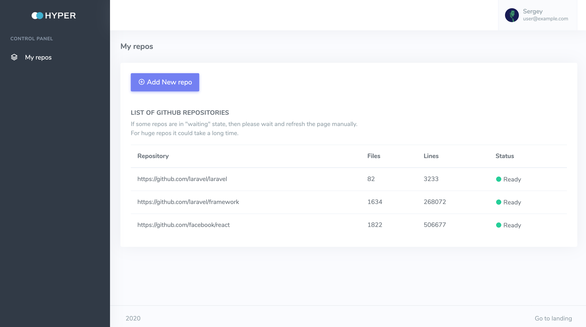
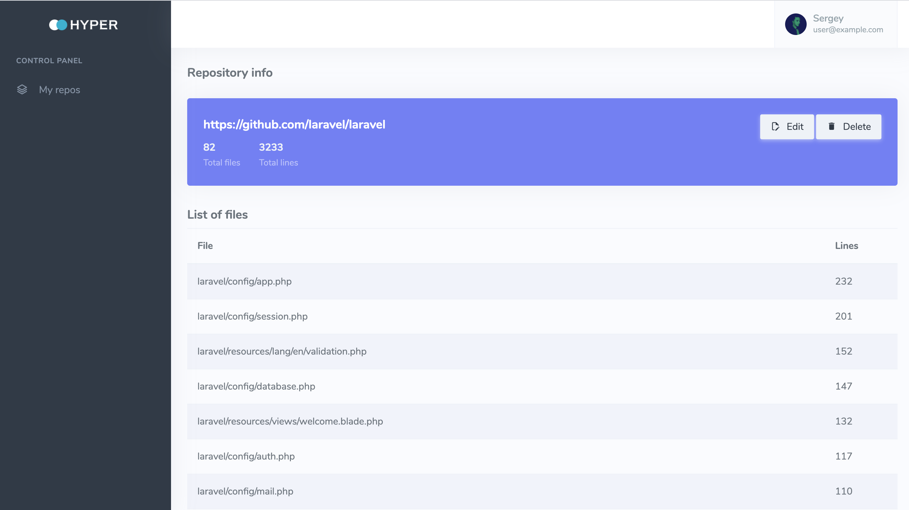

## App description 

It is a simple Laravel app to retrieve information about Github repositories.
Sometimes it is interesting how many files and lines of code particular repo contains.
While experimenting with the tool, I was surprised that some open-sourced projects raised 
Series A funding with just 40K LOC and some other projects contains millions of LOC under the hood.

App is built on top of LEMP stack (Linux + nginx + PHP-FPM + MySQL), and docker-compose config file 
is provided to replicate the environment.

## UI screenshots 

